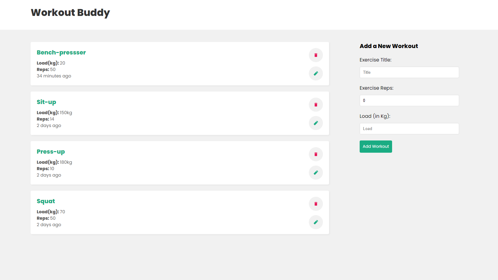

Learning or Refreshing MERN stack from The NetNinja
[Youtube channel](https://www.youtube.com/watch?v=8DploTqLstE&list=PL4cUxeGkcC9iJ_KkrkBZWZRHVwnzLIoUE&index=2)

## Screenshot :camera:

## API ENDPOINT :rocket:

| Index |     ENDPOINT      | Method |
| ----- | :---------------: | -----: |
| 1     |   /api/workouts   |    GET |
| 2     | /api/workouts/:id |    GET |
| 3     |   /api/workouts   |   POST |
| 4     | /api/workouts/:id | DELETE |
| 5     | /api/workouts/:id |  PATCH |

## Author

👤 **Haroon Abdulrazaq**

- Github: [@githubhandle](https://github.com/Haroonabdulrazaq)
- Twitter: [@twitterhandle](https://twitter.com/hanq_o)
- Linkedin: [linkedin](https://www.linkedin.com/in/haroonabdulrazaq)

## Show your support

Give a ⭐️ if you like this project!

## Acknowledgments

The NetNinja for the awesome referesher/tutorial
Icons by React-icons

## 📝 License

This project is [MIT](lic.url) licensed.
